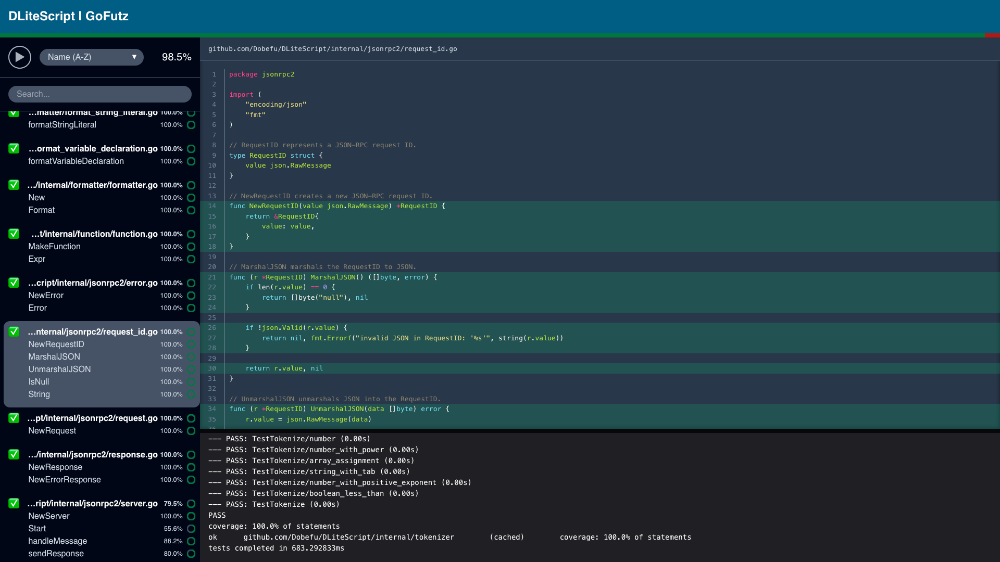

# GoFutz

[](https://golang.org/)
[](https://golang.org/)
[](https://sonarcloud.io/summary/new_code?id=Dobefu_gofutz)
[](https://goreportcard.com/report/github.com/Dobefu/gofutz)



A Go test UI that watches your files and runs tests automatically.
Coverage is shown directly in the browser with syntax highlighting.

## Why use GoFutz?

When writing tests, checking for coverage can get tedious very quickly.
For me, I usually automate it with [Air](https://github.com/air-verse/air) or [Entr](https://github.com/eradman/entr).
But as the codebase grows, I either have to keep re-writing the command for each test I work on,
or I just run all tests and have to scroll back to see the coverage.

GoFutz allows you to just have a browser window open, click on the file you're
working on, and see the coverage update in real time.
No scrolling or re-running of commands needed.

## What it does

- Runs tests when you save Go files
- Shows test coverage live in the browser
- Highlights lines that are covered or uncovered

## Installation

```bash
go install github.com/Dobefu/gofutz@latest
```

## Usage

```bash
gofutz
```

This will run the application of the default port `7357`.
For a different port, the `--port` flag can be used.

Go to `http://localhost:7357` to view the test dashboard.
